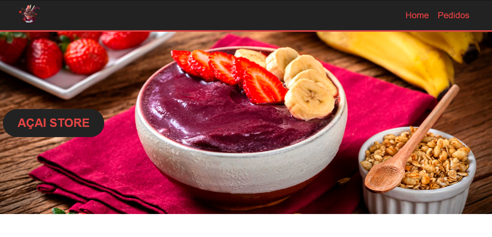

# Aplicação de Pedidos de Açaí com Vue

Este repositório contém uma aplicação web de pedidos de açaí desenvolvida usando o framework Vue.js. A aplicação permite que os usuários escolham diferentes sabores de açaí, adicionem coberturas e complementos, e finalizem seus pedidos.

## Funcionalidades

- Exibição dos sabores de açaí disponíveis.
- Adição e remoção de coberturas e complementos.
- Gerenciamento de pedidos.

